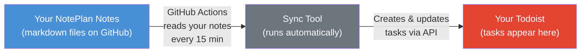
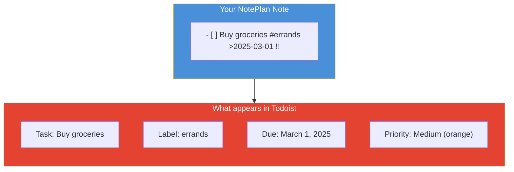
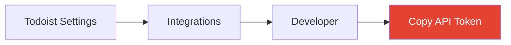
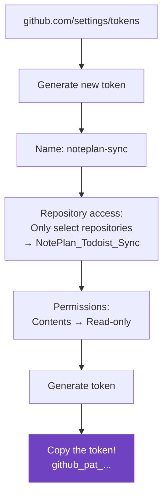
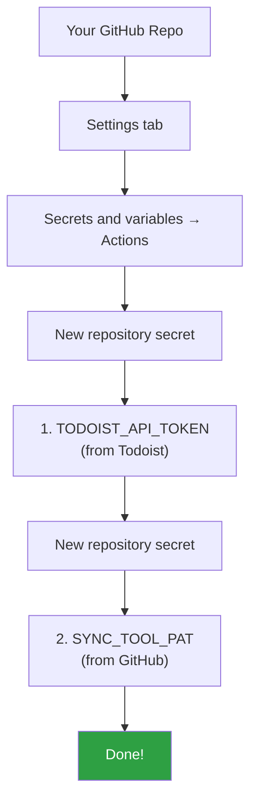
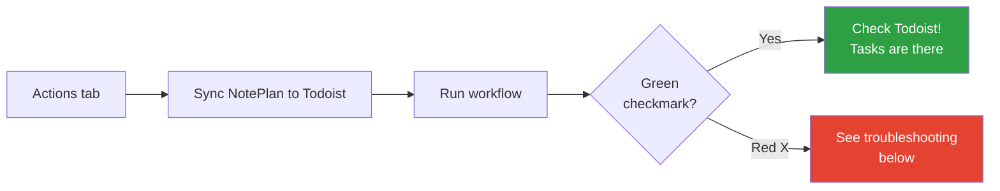
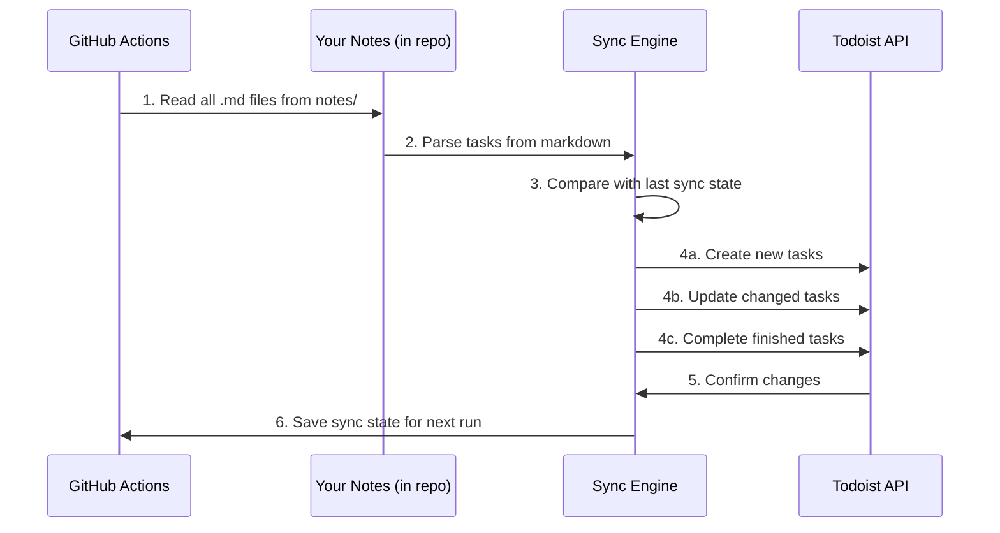

# Installation Guide for John

Hey John! This guide will walk you through setting up the NotePlan-to-Todoist sync on your own GitHub repo that already has notes in it. No coding experience needed — just follow the steps.

## What does this thing actually do?

You know how you write tasks in your NotePlan notes? This tool reads those notes on GitHub and automatically creates matching tasks in your Todoist. Every 15 minutes, it checks for changes and keeps Todoist up to date.



**In plain English:** You write notes with tasks, push them to GitHub, and they magically show up in Todoist.

## What gets synced?

The tool reads your markdown files looking for lines that look like tasks. Here's how your NotePlan formatting maps to Todoist:



Here's the cheat sheet for what the tool understands:

| What you write | What it means | What happens in Todoist |
|---|---|---|
| `- [ ] Do something` | An open task | A new task gets created |
| `- [x] Did something` | A completed task | The task gets checked off |
| `#errands` | A tag | Becomes a Todoist label |
| `>2025-03-01` | A due date | Sets the due date |
| `>today` | Due today | Sets due date to today |
| `>tomorrow` | Due tomorrow | Sets due date to tomorrow |
| `!` | Low priority | Yellow priority flag |
| `!!` | Medium priority | Orange priority flag |
| `!!!` | High priority | Red priority flag |

Anything that *isn't* a task line (headings, paragraphs, bullet points without checkboxes) is completely ignored. Your notes stay yours.

---

## Setup (one-time, about 15 minutes)

### Step 1: Get your Todoist API token

The tool needs permission to add tasks to your Todoist account. You give it that permission with an "API token" — think of it like a password that only this tool will use.

1. Open Todoist in your browser and log in
2. Go to **Settings** (click your profile picture in the top-left, then "Settings")
3. Click **Integrations** in the left sidebar
4. Click **Developer** at the bottom of the page
5. You'll see your **API token** — a long string of letters and numbers
6. **Copy it** (you'll need it in a moment)



> **Keep this token private!** Anyone with this token can modify your Todoist. We'll store it safely as a GitHub "secret" in the next step — it won't be visible in your code.

### Step 2: Create a GitHub Personal Access Token (PAT)

The sync tool lives in a separate private GitHub repo. For your notes repo to be able to download it, you need to create a "Personal Access Token" — think of it as a key that lets one of your repos access another.

1. Go to [github.com/settings/tokens?type=beta](https://github.com/settings/tokens?type=beta) (this takes you to your GitHub token settings)
2. Click **"Generate new token"**
3. Give it a name like `noteplan-sync`
4. Under **"Repository access"**, select **"Only select repositories"**, then pick the **NotePlan_Todoist_Sync** repo
5. Under **"Permissions" → "Repository permissions"**, set **Contents** to **Read-only** (that's all it needs)
6. Click **"Generate token"**
7. **Copy the token** — it starts with `github_pat_...`. You won't be able to see it again!



### Step 3: Add secrets to your GitHub repo

GitHub "Secrets" are a safe place to store sensitive values like API tokens. The sync tool will be able to read them, but they'll never show up in your code or logs. You need to add **two** secrets.

1. Go to your GitHub repo in the browser (the one with your notes)
2. Click the **Settings** tab at the top of the repo

   > If you don't see a Settings tab, you may not be the repo owner. You need to be the owner or have admin access.

3. In the left sidebar, click **Secrets and variables**, then **Actions**
4. Click the green **"New repository secret"** button
5. Add the **first** secret:
   - **Name:** `TODOIST_API_TOKEN`
   - **Secret:** paste the Todoist API token from Step 1
6. Click **"Add secret"**, then click **"New repository secret"** again
7. Add the **second** secret:
   - **Name:** `SYNC_TOOL_PAT`
   - **Secret:** paste the GitHub Personal Access Token from Step 2



**Optional:** If you want tasks to go to a specific Todoist project instead of your Inbox, add a third secret:
- **Name:** `TODOIST_PROJECT_ID`
- **Secret:** your project ID (you can find this in the Todoist URL when viewing a project — it's the number at the end, like `https://todoist.com/app/project/1234567890` → the ID is `1234567890`)

### Step 4: Make sure your notes are in the right place

The tool looks for markdown files (`.md`) inside a folder called **`notes/`** in your repo. If your notes are already there, great — skip ahead!

If your notes are in a different folder (like the root of the repo, or a folder called `docs/`), you have two options:

**Option A: Move your notes into a `notes/` folder**

This is the simplest. Just move or reorganize your markdown files so they're under `notes/`.

**Option B: Tell the tool where your notes are**

In the workflow file (we'll add this in the next step), you can change `NOTES_DIR: notes` to point to wherever your notes live, like `NOTES_DIR: docs` or `NOTES_DIR: .` (for the root).

### Step 5: Add the sync workflow to your repo

This is the file that tells GitHub "hey, run this sync tool for me." You need to create it in a specific spot.

1. In your repo, create the folder path `.github/workflows/` (if it doesn't already exist)
2. Create a new file at `.github/workflows/sync.yml`
3. Paste in the following content:

```yaml
name: Sync NotePlan to Todoist

on:
  # Run when notes change
  push:
    branches: [main]
    paths:
      - "notes/**"

  # Also run every 15 minutes
  schedule:
    - cron: "*/15 * * * *"

  # Allow you to run it manually from GitHub
  workflow_dispatch:

permissions:
  contents: read

jobs:
  sync:
    runs-on: ubuntu-latest

    steps:
      - name: Checkout your notes
        uses: actions/checkout@v4

      - name: Checkout sync tool
        uses: actions/checkout@v4
        with:
          repository: jstephens-netizen/NotePlan_Todoist_Sync
          path: _sync_tool
          token: ${{ secrets.SYNC_TOOL_PAT }}

      - name: Set up Python
        uses: actions/setup-python@v5
        with:
          python-version: "3.12"

      - name: Install sync tool
        run: pip install ./_sync_tool

      - name: Restore sync state
        uses: actions/cache@v4
        with:
          path: .sync_state.json
          key: sync-state-${{ github.sha }}
          restore-keys: |
            sync-state-

      - name: Run sync
        env:
          TODOIST_API_TOKEN: ${{ secrets.TODOIST_API_TOKEN }}
          TODOIST_PROJECT_ID: ${{ secrets.TODOIST_PROJECT_ID }}
          NOTES_DIR: notes
        run: python -m noteplan_todoist_sync.main
```

> **If your notes aren't in a `notes/` folder**, change `NOTES_DIR: notes` on the second-to-last line to match your folder name. Also update the `paths:` line near the top (e.g., change `"notes/**"` to `"docs/**"`).

**How to create this file on GitHub (without the command line):**
1. Go to your repo on GitHub
2. Click **"Add file"** → **"Create new file"**
3. In the filename box, type: `.github/workflows/sync.yml` (GitHub will auto-create the folders)
4. Paste the YAML content above
5. Click **"Commit changes"**

### Step 6: Test it out

Let's make sure everything is connected.

1. Go to the **Actions** tab in your repo
2. You should see **"Sync NotePlan to Todoist"** in the left sidebar
3. Click on it, then click **"Run workflow"** → **"Run workflow"** (the green button)
4. Wait about 30 seconds, then refresh — you should see a green checkmark
5. Open Todoist — your tasks should be there!



---

## How the sync cycle works

Here's what happens every time the sync runs:



The tool keeps a "memory" of what it's already synced (called the sync state). This means:
- It won't create duplicate tasks
- If you change a task's due date or priority in your notes, the Todoist task updates too
- If you check off a task in your notes (`- [x]`), it gets completed in Todoist

---

## Troubleshooting

### The workflow failed (red X)

Click on the failed run to see the logs. Common issues:

- **"fatal: could not read Username for 'https://github.com'"** — The `SYNC_TOOL_PAT` secret is missing or expired. Go back to Step 2 and create a new Personal Access Token, then update the secret in Step 3.

- **"Configuration error: TODOIST_API_TOKEN environment variable is required"** — The `TODOIST_API_TOKEN` secret wasn't set correctly. Go back to Step 3 and make sure the name is exactly `TODOIST_API_TOKEN` (all caps, with underscores).

- **"No tasks found, nothing to sync"** — The tool couldn't find any tasks. Check that:
  - Your notes are in the `notes/` folder (or the folder you specified)
  - Your tasks use the `- [ ]` format (dash, space, brackets, space)
  - Your files have the `.md` extension

- **"Failed to create task"** — Usually means your API token is wrong or expired. Get a new one from Todoist and update the secret.

### Tasks aren't showing up in Todoist

- Make sure you're checking the right project. By default, tasks go to your **Inbox**.
- Check the Actions tab — did the workflow actually run? It only triggers on push to `main` or every 15 minutes.

### I changed a task but Todoist didn't update

The tool identifies tasks by their file name and line number. If you rearranged lines (added or removed lines above the task), it might think it's a new task. This is normal — you might see a duplicate, which you can delete manually.

---

## Example: what your notes should look like

Here's a real example of a note file that the tool can read:

```markdown
# Weekly Planning

## Work
- [ ] Finish Q1 report #work >2025-03-15 !!!
- [ ] Review Sarah's proposal #work #review !!
- [x] Submit timesheet #work

## Personal
- [ ] Buy birthday gift for Mom #personal #shopping >2025-03-10
- [ ] Call plumber #home !
- [ ] Book flights for vacation #personal #travel >tomorrow

## Notes
Remember to check the project timeline before the Friday meeting.
This paragraph is completely ignored by the sync tool.
```

This would create 5 tasks in Todoist (the completed "Submit timesheet" is skipped since it's already done, and the paragraph at the bottom is ignored).

---

## Quick reference

```mermaid
mindmap
  root((Task Format))
    Status
      - [ ] Open
      - [x] Done
    Priority
      ! Low
      !! Medium
      !!! High
    Due Date
      >2025-03-15
      >today
      >tomorrow
    Tags
      #work
      #personal
      #any-tag-name
```

That's it! Once it's set up, you just write your notes and push to GitHub. The sync takes care of the rest.
